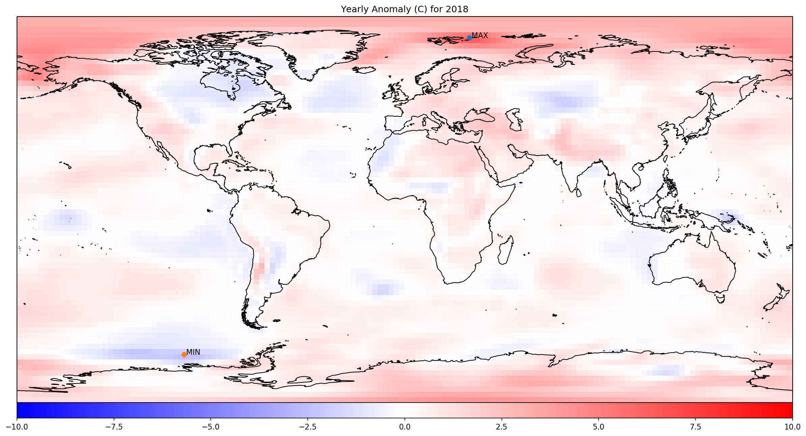
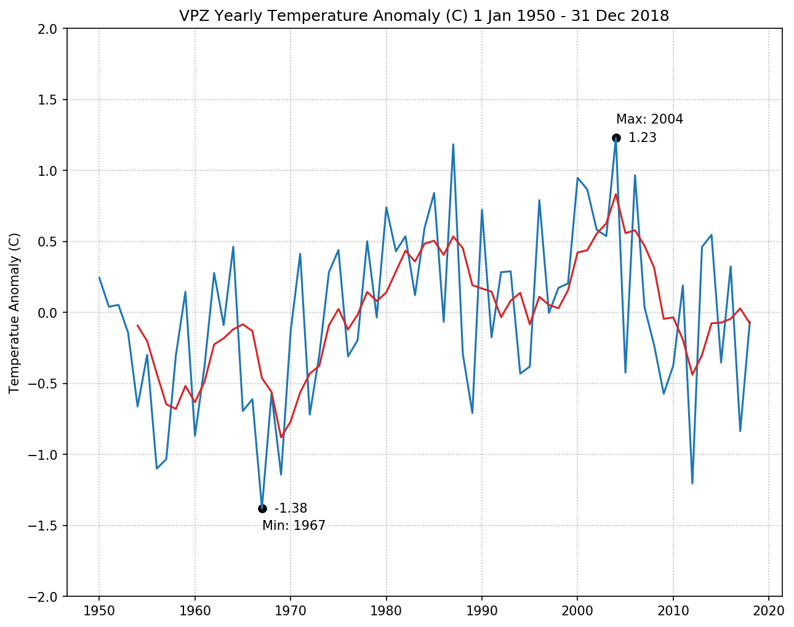

**Problem Set \#7**

**Assignment Learning Objectives**

1.  Integrate use of remote data sources

2.  Performing statistical relationships to decipher atmospheric
    patterns

3.  Strengthen link between scientific questions and generating computer
    programs to produce output in service of those questions.

**Due 5 November 2020 by 3:00 pm**

*Due Online*

-   The final script in the PSet7 repository on your GitHub account

*Due Via Blackboard*

-   A PDF version of your code. Make sure the honor code appears in the comment block at the
beginning of the script and that it has your full typed out name. This will serve as your 
assertion that you have upheld the honor code.

-   A PDF version of your responses to the questions.

**Honor Code**

You must type the full honor code into each comment block to indicate
that you have upheld the code. Authorized aid for this assignment is
your notes and any previous programs you have written. You are highly
encouraged to work with others in the class to help diagnose bugs and
work out programming logic. Any copying of someone else's code IS A
VIOLATION OF THE HONOR CODE, whether from a classmate, or the Internet.
*Be sure to indicate with whom you have worked in the comment block of
your submission.*

**Introduction**

Using computers to answer scientific questions is an essential aspect of
21^st^ Century meteorology. So far this semester, computer-programming
tools have been developed to work on various aspects of meteorological
calculation and visualization. In this assignment there will be a series
of questions to be answered that cover various temporal aspects of
climate. Unlike previous assignments, this one the computer won't
"answer" all of the questions, but rather you'll do a series of
calculations, make some graphical output, then create formal written
responses after analyzing the output of your programs.

**Long-term Climate**

Program Name: **climate\_anomaly.py**

Program Input: NCEP/NCAR Reanalysis data via remote data access

Use monthly mean air temperature from the sig995 level

(<https://www.esrl.noaa.gov/psd/thredds/catalog/Datasets/ncep.reanalysis.derived/surface/catalog.html?dataset=Datasets/ncep.reanalysis.derived/surface/air.sig995.mon.mean.nc>)

And the long-term mean

(<https://www.esrl.noaa.gov/psd/thredds/catalog/Datasets/ncep.reanalysis.derived/surface/catalog.html?dataset=Datasets/ncep.reanalysis.derived/surface/air.sig995.mon.ltm.nc>)

Program Output: Global temperature anomaly maps for 2019
(**global\_anomaly\_2019.png)**; Time series of surface temperature
anomalies from Jan. 1951 through Dec. 2019 for a specific location
 (**global\_average\_anomaly.png**).

Written Response: Formal typed response to questions \#3

**Problems**

1.  Create a Python program that will perform calculations and create
    output graphics that enable the following set of questions to be
    answered.

    a.  What does the variation in yearly global surface temperature
        anomalies (from the 1981--2010 long-term mean) look like across
        the globe for 2019? (Graphic)

    b.  What locations had the warmest and coldest anomalies for the
        year? Plot a marker and the anomaly value on the map from
        problem 1a.

2.  Add to the Python program in 1a calculations and output graphics
    that enable the following set of questions to be answered.

    c.  What are the yearly average surface temperature anomalies (from
        the 1981--2010 long-term mean) from Jan. 1950 to Dec. 2019 for
        Minneapolis, MN (44.98°N; -93.27°E)? For extra credit, compute a
        five-year running mean (valid at the last year of the mean) for
        the yearly average temperature anomalies. (Graphic)

    d.  What have been the warmest and coldest years? Indicate them on
        the time series graphic from problem 1a with the value of the
        anomaly for each.

3.  Create a pseudo blog post about the graphic created that allows
    non-scientists to correctly interpret information contained in the
    time series and the 2019 global anomaly map. Be sure to adequately
    reference the graphic in the post, as well as anything needing
    particular reference to explain what is in the graphic and what it
    means. Specifically discusses the year 2019 and how region
    perceptions about the year could be different as compared to the
    global mean average temperature anomaly based on where you live.
    Feel free to focus on regions of the U.S. or across the entire
    world, it's up to you. (Written Response)

    Notes:

    -   Longitudes are in the range 0 to 360E; slicing will have to be
        done accordingly

    -   Temperature Anomalies

        - Tanom = Tcurrent - TLTM

        1. Read in both current and long-term mean data

        2. Isolate the year for the analysis from the current data

        3. Compute the anomaly for each grid point for the current year monthly data 
        (both arrays should have the same shape)

        4. Compute the average anomaly for each grid point by averaging over the 12 months

    -   Finding max/min values of 2D data can be accomplished with the where method on an 
    Xarray DataArray - as exampled in the lecture material.

    -   Cyclic Points for display purposes can be accomplished with a
        Cartopy method

        (<https://scitools.org.uk/cartopy/docs/latest/cartopy/util/util.html?highlight=add_cyclic>)

    -   The module Xarray provides a method for computing running means.
        (<http://xarray.pydata.org/en/stable/generated/xarray.DataArray.rolling.html>)

Output Examples:

Yearly Global Mean Temperature Anomaly:

Valparaiso, IN Yearly Anomalies 1950-2019:

**Evaluation Criteria**

Each of the following criteria will be rated from not present/completed
to exemplary, having all of the elements will yield at least a 7/10 for
a particular criterion. The assignment is out of 50 points.

-   Efficiently coded and correct Problem 1 (10 points)

-   Efficiently coded and correct Problem 2 (10 points)

-   Problem 3 Write-up of Pseudo-Blog Post (10 points)

-   Informative and Clear Output from running code (10 points)

-   Code is well documented (informative comments/descriptions of code
    blocks; 5 points)

-   Code was regularly updated and committed to GitHub repository (5
    points)
